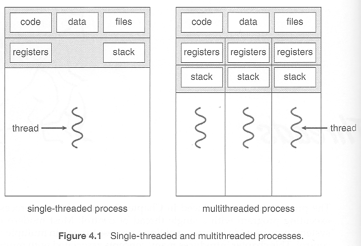

# Concurrent Computing

병행(동시) 컴퓨팅은 여러 연산을 순차적으로 처리하지 않고 동시에 병행 처리하는 방식이다.

## Thread

독립적인 CPU 시간과 메모리 공간을 점유하는 프로세스와 달리 쓰레드는 하나의 자원을 공유한다.

Word와 Chrome 프로세스는 서로 동시에 실행되지도 않으며, 메모리를 공유하지도 않는다. 하지만 여러 쓰레드는 heap 메모리를 공유하기 때문에 전역 변수와 코드를 동시에 접근할 수 있다.

<!-- more -->

일반적으로 코드는 `main()` 함수부터 순차적으로 실행되기 때문에 모든 작업이 동기화되어 있다. 하지만 쓰레드를 사용하면 다른 연산과 병행하면서 일을 동시에 처리하는 이점이 생긴다.

## Concurrency



일을 동시에(concurrently) 처리한다는 것을 이해하기 위해 컴퓨터구조를 들여다보자.

함수 안에서 지역적 연산 과정과 결과를 담는 **레지스터**, **스택** 메모리는 각 쓰레드에 독립적으로 할당된다. 반면 프로세스 생명주기에 걸쳐 영속적인 **힙 메모리**와 **전역 변수**는 어떤 위치에서든 접근할 수 있어야 되기 때문에 모든 쓰레드가 공유하는 형태이다.

## Race condition

> 어떤 시스템에 입력되는 복수의 신호를 조작하는 타이밍, 순서에 따라 결과가 영향을 받는다면 **경쟁 상태**에 놓여있다고 본다.
> 

병렬 컴퓨팅 관점에서 **경쟁 상태**를 설명하면 여러 쓰레드가 변수를 공유할 때 일정 조건이나 타이밍에서 프로그램이 오작동하거나 예상과 다른 결과를 만들어낼 수 있다. 경쟁 상태를 방지하는 데 사용되는 기법으로 상호배제, 동기화 등이 있다.

## Mutual exclusion

Mutual exclusion(상호 배제)는 특정 자원의 동시 접근을 제한하는 기술이다.

## Critical section

자원에 접근하는 코드는 critical section(임계 영역)으로 설정하고, 아래 조건을 충족해야 한다.

1. **상호배제** - 한 프로세스가 점유 중일 때 다른 프로세스는 들어갈 수 없다.
2. **진행** - 진입하려는 프로세스가 여러 개일 때 누가 먼저 들어갈 지 결정해야 한다.
3. **한정** **대기** - 임계 영역 앞에서 대기하는 프로세스는 영원히 대기할 수 없다.

임계 영역을 구현하는 기법으로 `Mutex`, `Semaphore`, `Monitor`가 있다.

## Mutex

Condition variable(조건 변수)를 활용하여 consumer 패턴 상호배제를 구현한 C 코드

```c
static pthread_mutex_t mtx = PTHREAD_MUTEX_INITIALIZER;
static pthread_cond_t cond = PTHREAD_COND_INITIALIZER;

static int avail = 0;

// Consumer pattern
while (TRUE) {
    s = pthread_mutex_lock(&mtx);

    while (avail == 0) {  // Wait for something to consume
       s = pthread_cond_wait(&cond, &mtx);
    }

    while (avail > 0) {  // Consume all available units 
        avail--;
    }

    s = pthread_mutex_unlock(&mtx);
}
```

## Parallel Computing

병렬 컴퓨팅은 다수의 프로세서를 동시에 사용하여 연산하는 방법으로, 느려터진 직렬 연산을 개선하는 부분에서 동시 컴퓨팅과 유사하지만 코어끼리 자원을 공유하지 않고 독립적으로 처리한다는 점에서 근본적인 차이가 있다. 단일 코어에서 복수의 작업(instruction)을 번갈아 처리하는 눈속임이 아니라, 각 작업을 독립적으로 할당하여 말 그대로 동시에 처리하는 것이 병렬 컴퓨팅이다.

[OpenMP](openmp.md)를 사용하면 C/C++, Fortran 언어에서 CPU 병렬 프로그래밍을 빠르게 구현할 수 있으며,  NVIDIA GPU 환경에서 텐서 기반 병렬 프로그래밍을 구현하려면 CUDA를 사용해야 한다.
