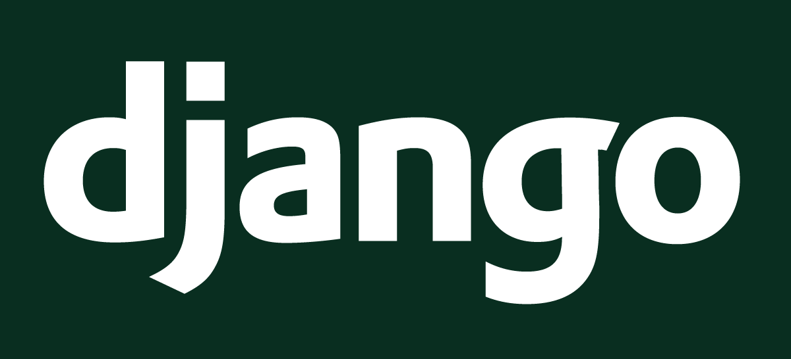

지금은 Python과 Django만 있으면 Fullstack 웹사이트 개발이 가능한 시대.
수많은 기술이 자동화되어 개발 장벽은 낮아졌지만, 프레임워크 내부 구현이 동작하는 방식은 그만큼 복잡해졌다.  
레퍼런스에서 등장하는 핵심 키워드를 중심으로 Django 프레임워크를 파헤쳐 보자.

<!-- more -->

# Application


Application(속칭 App)은 django 웹사이트를 구성하는 파이썬 패키지를 일컫는다.
Auth 인증처럼 자주 쓰이는 기능은 App 형태로 기본 제공되지만 사이트 고유 기능은 웹 개발자가 직접 개발해야 한다.
템플릿, 뷰, 모델을 기능에 따라 App 단위로 쪼개서 개발하면 코드의 재사용, 프로젝트 확장 및 유지보수가 용이하다.

# Model
모델 레이어는 웹사이트가 기억할 정보를 클래스 형태로 정형화하는 작업을 수행한다. 
`Model`을 구현하면 DB에 저장될 데이터를 클래스 단위로 정의할 수 있다.
정의된 모델을 기반으로 스키마를 자동 생성하는 Migration 기능과 ORM 기능은 django에 기본 탑재되어 있다.

!!! info
    ORM(Object Relational Mapper)를 사용하면 레코드와 런타임 객체가 1:1 매핑된다.
    덕분에 프로그래머는 SQL 쿼리문을 작성하지 않고 query API만 사용해서 데이터베이스에 접근하고 레코드를 CRUD할 수 있다.

``` py
from django.db import models


class Person(models.Model):
    first_name = models.CharField(max_length=30)
    last_name = models.CharField(max_length=30)
```

사용자 정의 모델은 반드시 `django.db.models.Model` 클래스를 상속해야 한다.
문자열 `first_name`과 `last_name`을 속성으로 갖는 Person 모델을 정의하고, `python migrate.py migrate` 명령어를 실행하면
아래와 같이 데이터베이스 테이블을 생성하는 쿼리문이 실행된다.

``` sql
CREATE TABLE myapp_person (
    "id" bigint NOT NULL PRIMARY KEY GENERATED BY DEFAULT AS IDENTITY,
    "first_name" varchar(30) NOT NULL,
    "last_name" varchar(30) NOT NULL
);
```

# View
뷰 레이어는 HTTP 요청을 처리하고 적절한 응답을 반환하는 일종의 컨트롤러 역할을 수행한다.
뷰 함수는 일반적으로 `HttpRequest` 타입의 request, 그리고 URLconf에서 캡처된 값들로 구성된 kwargs를 인자로 받는다.   

``` py
from django.shortcuts import render
from polls.models import Question


def index(request):
    # poll 5 latest records from db
    latest_question_list = Question.objects.order_by("-pub_date")[:5]
    context = {'latest_question_list': latest_question_list}
    
    # render a template html and return it
    return render(request, "polls/index.html", context)
```

## Generic view
Model을 통해 레코드를 읽고 템플릿 context에 전달해서 HTML 화면을 반환하는 로직은 매우 빈번하게 발생하고,
반복되는 패턴이다. 하지만 아래처럼 Generic view를 사용하면 해당 로직을 django에 맡길 수 있다.

- `ListView` - 특정 모델에 대응하는 레코드를 전부 화면에 표시할 때 사용
- `DetailView` - 특정 모델 레코드 1개의 정보를 상세 화면에 표시할 때 사용

``` py
from django.views import generic


class IndexView(generic.ListView):
    template_name = "polls/index.html"
    context_object_name = "latest_question_list"

    def get_queryset(self):
        return Question.objects.order_by("-pub_date")[:5]
```

## View name
`urls.py` 파일에서 URL과 매핑할 때 정의한 뷰 이름이 다른 앱에서 사용하는 뷰 이름과 중복될 경우
이름 충돌이 발생한다. 아래 코드처럼 namespace를 추가하면 문제가 해결되지만,
뷰를 외부에서 참조할 때 사용하는 이름은 `view_name`이 아니라 `app_name:view_name`으로 수정해야 한다.

``` py title="urls.py"
from django.urls import path
from . import views

# define a namespace
app_name = 'polls'

urlpatterns = [
    path("", views.index, name="index"), # (1)!
    path("<int:question_id>/", views.detail, name="detail"), # (2)!
]
```

1. Actual name is `polls:index`
2. Actual name is `polls:detail`
