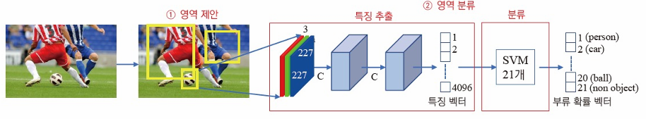
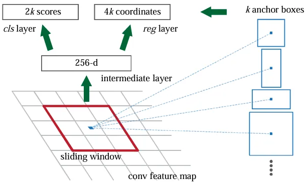
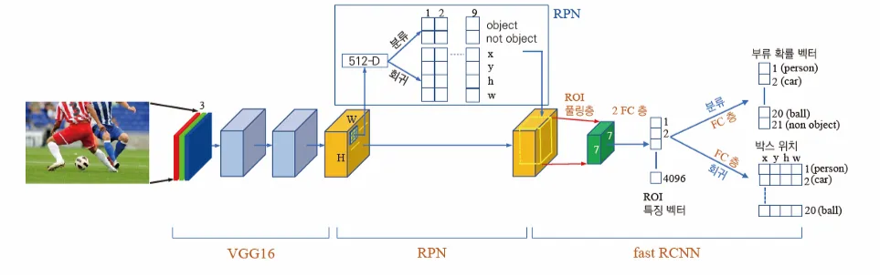
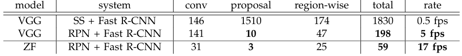

# Faster R-CNN with RPN

## 두 단계 방법

- 기존 R-CNN 모델이 물체를 검출하는 방법
    - 후보 영역 생성 → 물체 검출
    - 두 단계가 독립적이고 메모리 공간을 공유하지 않음 (병렬화 X)
- **후보 영역 생성**
    - 물체가 있을 가능성이 높은 영역을 생성하는 단계
    - Selective Search 알고리즘 채택
        - 슈퍼 화소 분할 → 군집화
- **물체 검출**
    1. 후보 영역을 227 x 227 맵으로 정규화
    2. 합성곱으로 4096차원 특징 벡터 추출
    3. SVM 으로 물체 부류 확률 예측

<!-- more -->

### 영역 제안 네트워크

> Region Proposal Network, RPN

- 후보 영역을 생성하는 새롭고 경량화된 방법
- 합성곱으로 N차원 특징 벡터 추출
    - ZF 특징맵 → N=256
    - VGG 특징맵 → N=512
- 추출된 특징을 2개의 FC layer 에 각각 입력으로 전달
    - 분류 계층: Objectness(객체 식별 여부) 예측
    - 회귀 계층: Anchor box 형태를 조절하는 파라미터 {x, y, h, w}

### Anchor

ZF 를 사용한다고 가정할 때 추출된 특징 벡터는 256차원

- 다양한 크기와 종횡비를 가진 사각형 박스
- 미리 정의된 k=9 가지 형태를 모두 사용
- Bounding box 를 예측하는 데 사용됨 (For reference)

## 한 단계 방법

- Selective Search 알고리즘을 RPN 으로 대체하여
- 영역 제안 → 검출까지 전 단계를 단일 신경망으로 통합
- 검출 성능과 속도를 획기적으로 개선

## 성능 평가

PASCAL VOC 2012 테스트 데이터 예측 성능. (SS = Selective Search)

K40 GPU 타이밍으로 측정한 검출 속도

- RPN 도입 후
    - mAP 2%p 증가 → 성능 소폭 개선
    - 지연시간 10배 감소 → 속도 개선