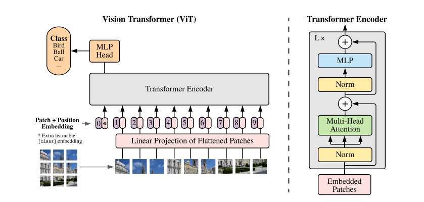
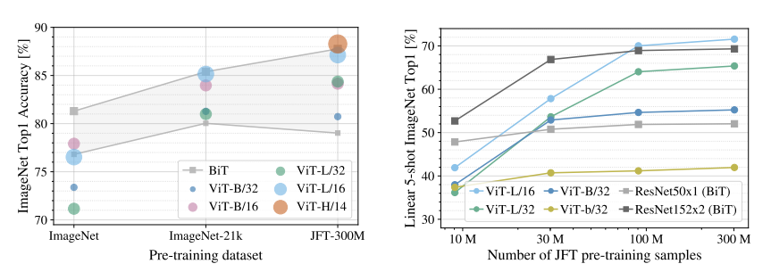

# Vision Transformer
> An Image is Worth 16x16 Words: Transformers for Image Recognition at Scale

시각적 패턴을 인식하는 합성곱 신경망(CNN)은 컴퓨터비전의 de facto 표준으로 폭넓게 사용되지만,
데이터에서 의미론적 문맥(semantic context)을 유추하는 학습은 불가능하다.
반면에 NLP 분야에서 주목받던 Transformer 계열의 추론 성능은 비약적으로 상승했는데,
학습량이 일정 수준을 넘어서면 모델이 처음 보는 작업에서도 zero-shot 추론이 가능함을 보였다.  
본 논문에서는 이미지 분류용 합성곱 레이어를 Transformer Encoder 로 대체한 새로운 유형의 모델을 제시하는데,
이는 CV 분야에서 고질적인 이슈로 지적되었던 일반화 성능 문제의 돌파구가 될 것으로 예상한다.

<!-- more -->

## Patch Embedding

ViT 모델은 이미지를 일정 크기의 패치(Patch) 조각으로 분할해서 토큰처럼 취급하기 때문에 기존 Transformer 구조가 그대로 재활용된다.

### 알고리즘
1. 2차원 이미지를 $P \times P$ 해상도를 갖는 $N$개의 패치로 분할하고 각각 D차원 벡터로 임베딩한다
2. 위치 정보를 반영하는 Positional embedding 을 각각의 패치 벡터에 더한다
3. [CLS] 토큰이 맨 앞에 추가된 패치 시퀀스를 조합해서 Encoder 입력으로 밀어넣는다

### 수식 모델
$$
\begin{aligned}
z_0 &= [x_{\text{class}}; x_p^1 E; x_p^2 E; ...; x_p^N E] + E_{\text{pos}}
\\
z' &= MSA(LN(z_{\ell - 1}) + z_{\ell - 1})
\\
z_{\ell} &= MLP(LN(z'_{\ell})) + z'_{\ell}
\\
y &= LN(z_L^0)
\\
\text{where }& E \in \mathbb{R}^{(P^2 \cdot C) \times D}, E_{\text{pos}} \in \mathbb{R}^{(N + 1) \times D}, \ell = 1 ... L
\end{aligned}
$$

## Inductive Bias
- 귀납 편향
  - 관측된 데이터를 일관되게 예측하려면 귀납적 추론으로 형성된 편향치가 요구된다
  - 일반화 성능은 모델의 귀납 편향이 모집단을 얼마나 반영하는지 평가하는 지표이다 
- 귀납 편향이 내제된 모델
  - 합성곱 레이어의 국소성(spatial locality)
  - 풀링 레이어의 이동불변성(translation invariance)
- 귀납 편향의 부재
  - 소규모 데이터로 학습된 ViT 성능이 저조한 이유를 논문에서는 "Lack of Inductive Bias" 로 설명한다
  - ViT 구조는 CNN 과 다르게 공간적 편향이 내제되지 않아서 순수하게 데이터 분포만으로 학습하게 된다

## Performance
> 논문 결론에서 제시된 실험 결과표

- 사전학습 데이터가 부족하면 일반화 성능이 CNN 보다 떨어진다
- 하지만 데이터 규모를 늘리면 성능이 역전된다 (JFT 기준 1억장)
  - 데이터 증강 및 규모 확장이 일반화 성능을 결정짓는 요인
