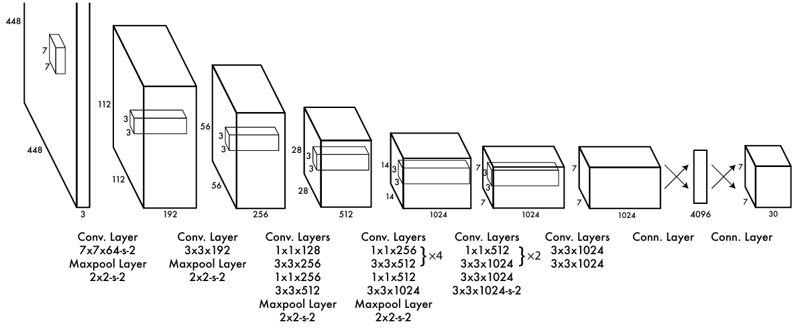
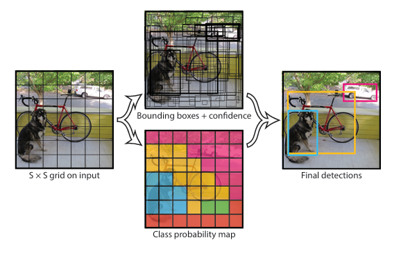
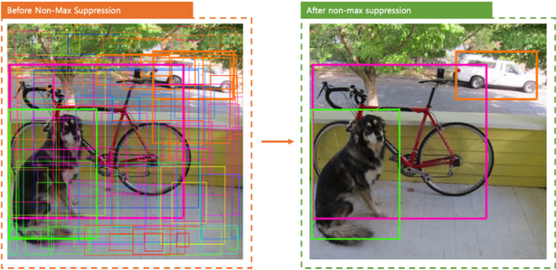

# YOLO: You Only Look Once

## 개요

YOLO 는 신경망 기반 “개체 탐지” 처리 속도를 비약적으로 향상시킨 모델이다. 주어진 이미지에 존재하는 모든 개체의 bounding box와 class probability를 한 큐에 생성하도록 설계되었다. 분류 신경망을 이미지에 국소적으로 적용하던 R-CNN 같은 기존 방식이 가지는 복잡성과 비효율성을 YOLO 모델이 해결하면서 실시간 개체 탐지 기술의 지평선을 열었다.

- Grid: 이미지를 S x S 격자로 쪼갠 것
- Cell: 격자를 구성하는 단위 셀

<!-- more -->

## 모델 출력

이미지가 CNN 층을 통과하면 S x S 격자의 텐서가 생성된다.

격자를 구성하는 cell 은 내부 물체의 경계, 신뢰도, 클래스 정보를 예측한다.

- 물체 경계 (bounding box)
    - $(\hat{x},\hat{y})$ : box 중심 좌표
    - $(\hat{w},\hat{h})$ : box 폭 및 높이
    - $\text{conf}$ : box 예측 신뢰도
- 신뢰도

$$
\begin{align*}
\text{conf} &= \Pr(\text{Object}) \times \text{IOU}^{truth}_{pred}
\\[1em]
\text{where }\Pr(\text{Object}) &=
\begin{cases}
0 &\text{if $(x,y)$ is out of bounds}
\\
1 &\text{otherwise}
\end{cases}
\end{align*}
$$

- 클래스 조건부 확률분포

$$
\Pr(\text{Class}_i|\text{Object})
$$

- 최종 출력 텐서

$$
\text{shape} = S \times S \times (5B + C)
\\
\text{where $S$ is grid size, $B$ is box count, $C$ is class count}
$$

## 훈련 전략

- ImageNet 데이터로 사전학습
- 사전학습 이후 추가적인 conv, fcn 레이어 도입
- 사전학습 이후 입력 이미지 크기 2배 조정
- $\hat{x},\hat{y},\hat{w},\hat{h}$ 정규화 (결과 범위: 0~1)

### 손실 함수

$$
\begin{align}
L &= \lambda_{coord} \sum_{i=0}^{S^2} \sum_{j=0}^B \mathbb{1}_{ij}^{\text{obj}} [(x_i - \hat{x}_i)^2 + (y_i - \hat{y}_i)^2]
\\
&+ \lambda_{coord} \sum_{i=0}^{S^2} \sum_{j=0}^B \mathbb{1}_{ij}^{\text{obj}} [(\sqrt{w_i} - \sqrt{\hat{w_j}})^2 + (\sqrt{h_i} - \sqrt{\hat{h_j}})^2]
\\
&+ \sum_{i=0}^{S^2} \sum_{j=0}^B \mathbb{1}_{ij}^{\text{obj}} (C_i - \hat{C_i})^2
\\
&+ \lambda_{noobj} \sum_{i=0}^{S^2} \sum_{j=0}^B \mathbb{1}_{ij}^{\text{noobj}} (C_i - \hat{C_i})^2
\\
&+ \sum_{i=0}^{S^2} \mathbb{1}_{i}^{\text{obj}} \sum_{c \in \text{classes}} (p_i(c) - \hat{p_i}(c))^2
\end{align}
$$

- 손실 함수 (Sum of squared error)
    - 1번째 항: Box 중심 좌표 오차 최소화
    - 2번째 항: Box 폭 & 너비 오차 최소화 (절댓값 크기가 영향을 주지 않도록 제곱근 사용)
    - 3번째 항: 신뢰도 오차 최소화
    - 4번째 항: 신뢰도 $\hat{C_i} \to 0$ 유도 ($\because \Pr(\text{Object}) = 0$)
    - 5번째 항: 클래스 분류 오차 최소화
- 조건부 계수
    - $\mathbf{1}_i^{\text{obj}}$ : i 번째 셀에서 개체가 존재하면 → 1
    - $\mathbf{1}_{ij}^{\text{obj}}$ : i 번째 셀에서 최대 IoU 를 가진 box 가 j 번째일 경우 → 1
- 손실 패널티 (학습 안정화 목적)
    - $\lambda_{coord} = 5$
        - Localization 오차 증폭계수
    - $\lambda_{noobj} = 0.5$
        - 개체가 없는 셀의 오차 감쇄계수

## 추론

1. 클래스별 신뢰도 계산
2. NMS 를 수행하여 불필요한 box 제거

## 문제점

- Localization 정확도 낮음
- 신뢰도 계산에서 Box 크기를 고려하지 않음
    - 작은 개체 탐지 어려움

## YOLOv2

[[Object Detection] YOLO v2 논문리뷰 및 코드구현(CVPR2017)](https://csm-kr.tistory.com/3)

## YOLOv3

[[Object Detection] YOLO v3 논문리뷰 및 코드구현](https://csm-kr.tistory.com/11)

